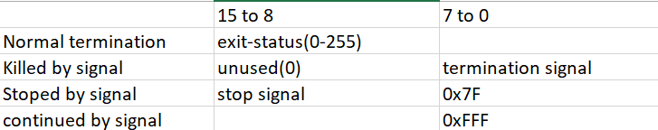

# WAIT(2) -system call  
waits for process to change state  

```bash
#include<sys/types.h>
#include<sys/wait.h>
```

```bash
pid_t wait(int *wstatus);
pid_t waitpid(pid_t pid,int *wstatus,int options);
```

## monitoring the child process/status

We need to use wait systemcall in parent process.  
Wait is blocking function it will block the parent execution till the child terminates.  
Upon successful waiting the wait systemcall returns the child id upon failure returns -1.  
If we uses wait in parent two problem can be solved  
- child is removed from `zombie`
- child never becomes an `Orphan`

```c
#include"header.h"
void main()
{
if(fork()==0)
{
printf("In child pid=%d\n",getpid())
sleep(15);
printf("In child after sleep..\n");
}
else
{
int r,s;
printf("In parent pid=%d\n",getpid())
r=wait(&s);
printf("In parent after wait r=%d,s=%d\n",r,s);
while(1);  //r=child pid s=256
}
}
```
variables filled by process manager child returns exit status to process manager,process manager then manages. 


## Disadvantages of wait()

since it is a polling condition (blocking) concurrency with child and process is lost.

**Q**  
Why is 256 not 1?  value retrurned by child,also known as sets child signal  


Using wait orphan child can be prevented and child can be removed from zombie status.  
In normal termination the return status /exit status is called by 2 byte higher 8 byte therefore s becomes 256.  
If killed by signal lower byte will hold signal number  
if kill -9 pid then the 2 byte will contain 9.

